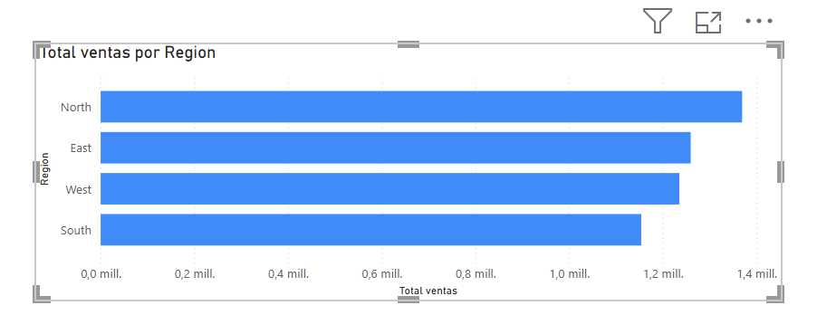
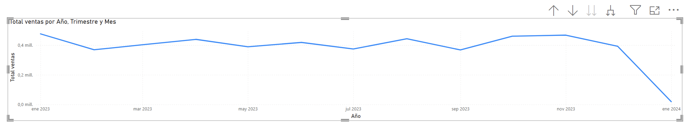

# Análisis de Ventas con Python, MySQL y Power BI

## Descripción

Este proyecto tiene como objetivo analizar datos de ventas para identificar tendencias y apoyar la toma de decisiones estratégicas, considerando variables como productos, categorías, regiones y periodos de tiempo.

Se construyó un flujo completo de datos (ETL), integrando Python, MySQL y Power BI.

## Tecnologías utilizadas

* Python (pandas, SQLAlchemy)
* MySQL
* Power BI
* SQL

## Flujo del proyecto

CSV → Python → MySQL → Power BI

1. Extracción de datos desde archivo CSV
2. Limpieza y procesamiento con Python
3. Carga de datos a MySQL
4. Análisis mediante SQL
5. Visualización en Power BI

## Estructura del proyecto

```
analisis-ventas/
├── data/
├── notebooks/
├── powerbi/
├── scripts/
├── sql/
├── requirements.txt
└── README.md
```

## Dashboard

A continuación se muestran algunas visualizaciones del análisis:





---

## 📈 Principales análisis

* Ventas por año, trimestre y mes
* Ventas por región
* Ventas por representante
* Ticket promedio
* Total de unidades

---

## 🎯 Conclusión

El análisis permite identificar patrones de venta y apoyar la toma de decisiones estratégicas sobre productos, categorías y comportamiento temporal.

---

## 🚀 Cómo ejecutar el proyecto

1. Clonar el repositorio
2. Instalar dependencias:

```
pip install -r requirements.txt
```

3. Ejecutar carga de datos:

```
python scripts/cargar_datos.py
```

4. Conectar Power BI a la base de datos

---
